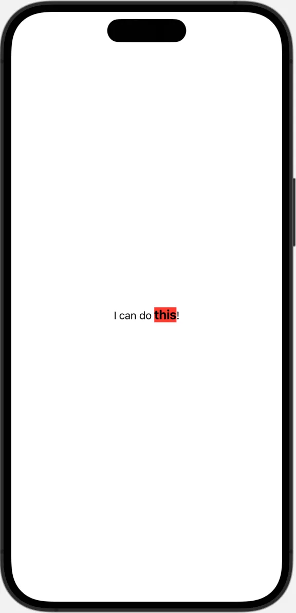
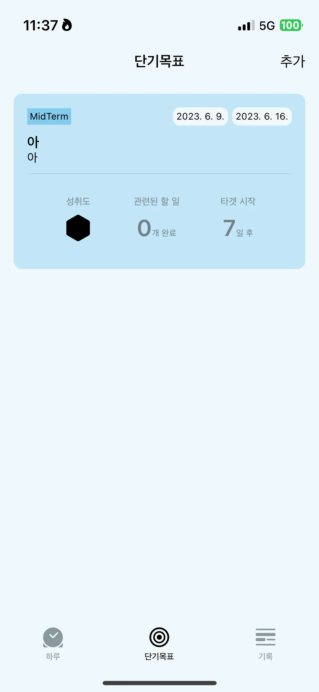
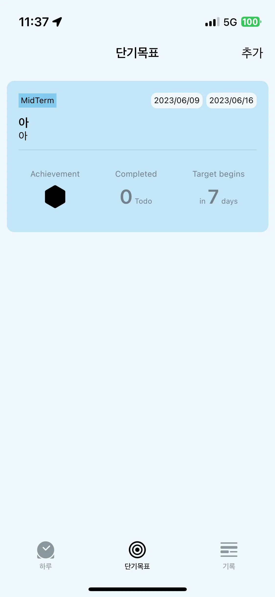

# AttributedString SwiftUI에서 사용하기(feat. localization)

AttributedString을 iOS 15.0부터 사용할 수 있게 됐다. SwiftUI에서도 사용할 수 있다.
AttributedString은 각각의 글자나 범위의 글자에 attributes를 가지고 있는 String이다. 거두절미하고 SwiftUI Text에 AttributedString을 사용한 예시를 들어보면,

```swift
var attributedString: AttributedString {
  var string = AttributedString("I can do this!")
  if let this = string.range(of: "this") {
    string[this].font = .title3.weight(.bold)
    string[this].backgroundColor = .red
  }
  return string
}

var body: some View {
  Text(attributedString)
}
```

이 코드의 결과는 이렇다.



AttributedString은 `@dynamicMemberLookup` 이라는 Attributes 덕분에 dot syntax를 편리하게 사용할 수 있다. ( 더 자세한 내용은 공식문서 확인)

개인적으로 앱을 개발하면서 AttributedString은 localization과 함께 쓰면 활용도가 높아진다고 느꼈다




위의 앱 개발 구동화면을 살펴보면 각 언어별로 단어의 구성이 달라진다. 이런 상황에서 숫자의 폰트만 크게 확대해서 강조하고 싶었다.

```swift
// .
// .
// .

var targetDayLeftCountString: AttributedString {
   getTargetBadgeString(localized: "\(target.dayDifferenceFromToday) target_dayLeft_count", number: target.dayDifferenceFromToday)
}

/// localizable 파일에 등록되어 있는 key를 인자로 받는다
/// 그 중 숫자부분은 추가로 인자로 받는다.
/// 속성이 적용된 AttributedString을 내보낸다.
private func getTargetBadgeString(localized string: LocalizedStringResource, number: Int) -> AttributedString {
        var attributedString = AttributedString(localized: string)
        // @dynamicMemberLookup Attribute의 특성을 이용한다
        // dot syntax로 속성을 정의할 수 있다.
        attributedString.font = .systemFont(ofSize: 10)
        attributedString.foregroundColor = .secondary

        // 전체적으로 속성을 정의해 준 뒤 숫자부분만 따로 큰 폰트를 적용한다.
        if let numberRange = attributedString.range(of: String(number)) {
            attributedString[numberRange].font = .title.weight(.semibold)
        }

        return attributedString
}

@ViewBuilder
var dayLeftBadges: some View {
        VStack {
            Text(isDateYetToCome ?
                 String(localized: "target_begins") :
                 String(localized: "target_due_date")
            )
                .font(.caption)
                .foregroundColor(.secondary)
                .fixedSize()
            Spacer()
            Text(targetDayLeftCountString) // 적용한 부분
            // Text(_ attributedContent: AttributedString)
        }
        .padding()
 }
```

그래서 우선 localized string 을 인자로 받아왔다.

또 ,숫자부분만 강조하려면 숫자 부분의 위치를 찾아야 하기 때문에 (range 메서드 이용) 인자로 추가로 받는 함수를 만들었다.

string 전체를 사이즈 10으로 적용하고 색상은 .secondary 로 적용했다.

다음으로 AttributedString 의 메서드인

```swift
func range<T>(of: T, options: String.CompareOptions, locale: Locale?) -> Range<Index>?
```

을 활용해 숫자의 위치를 파악하고 그 부분만 .title.weight(.semibold) 를 적용해줬다.

이렇게 한 이유는 숫자의 위치가 각 언어별로 바뀌기 때문이다.

AttributedStringKey 타입을 따르면 커스텀 속성을 만들 수 있다고 하니 더 알아봐야 할 것 같다.
